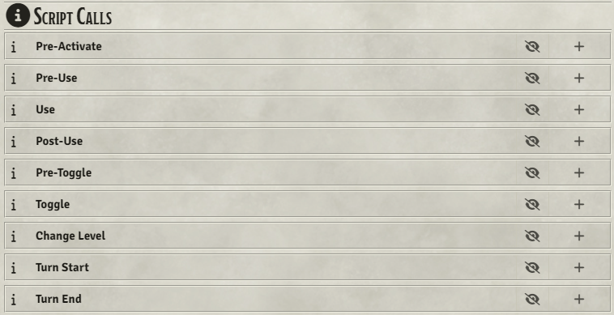

# PF1 New Script Hooks

A Foundry VTT module for the PF1 system that adds new hook points and script call categories for item actions, combat turn events, and buff toggling.

**Version:** 1.1.0  
**Foundry VTT Compatibility:** v13  
**Manifest URL:** `https://github.com/Hamilcarbarcas/pf1-new-script-hooks/releases/latest/download/module.json`

## Features

---

### Dialog Hooks

Wraps `ActionUse.prototype.createAttackDialog` to fire two new hooks around the attack dialog:

- **`pf1PreAttackDialog(actionUse, promises)`** — Fires immediately before the attack dialog opens.
- **`pf1PostAttackDialog(actionUse, formData, promises)`** — Fires immediately after the attack dialog closes, before `alterRollData` processes the form data.

Both hooks pass a `promises` array as the last argument. Async handlers can push a promise into this array and the wrapper will `await Promise.all(promises)` before continuing, ensuring all modifications complete before the form data is consumed. Synchronous handlers can simply ignore the extra argument.

---

### Script Call Categories

All categories appear in the script calls list on item sheets for easy access.

#### Pre-Activate (`preActivate`) — buff, feat, and all action item types
Runs before the attack dialog opens. Use for setup logic that needs to happen before the user sees the dialog.

**`shared` API:**
| Flag | Effect |
|---|---|
| `shared.reject = true` | Cancels the action entirely. The dialog never opens and `ActionUse.process()` aborts. |
| `shared.skipDialog = true` | Skips the attack dialog but continues the action with default form values. |

---

#### Pre-Use (`preUse`) — buff, feat, and all action item types
Runs after the attack dialog closes and before roll calculations begin. Use to modify `formData` based on the user's dialog choices (e.g. injecting attack/damage bonuses, setting flags).

`shared.formData` is populated with the dialog result before this fires.

**`shared` API:**
| Flag | Effect |
|---|---|
| `shared.reject = true` | Cancels the action after the dialog. |
| `shared.attackBonus.push(...)` | Adds a bonus to all attacks. |
| `shared.firstAttackBonus.push(...)` | Adds a bonus to the first attack only (sequential attacks module). |
| `shared.firstAttackDamageBonus.push(...)` | Adds a damage bonus to the first attack only (sequential attacks module). |

---

#### Turn Start (`turnStart`) — all item types
Runs at the start of the owning actor's combat turn, after PF1 has processed effect expiration and item recharging for that turn.

Fires on the actor's active owning client.

**Directly available variables:**
| Variable | Description |
|---|---|
| `combat` | The active `CombatPF` document. |
| `combatant` | The `CombatantPF` whose turn is starting. |
| `turn` | The current turn index (0-based). |
| `round` | The current round number. |

---

#### Turn End (`turnEnd`) — all item types
Runs at the end of the owning actor's combat turn, after PF1 has processed effect expiration for that turn.

Fires on the actor's active owning client.

**Directly available variables:**
| Variable | Description |
|---|---|
| `combat` | The active `CombatPF` document. |
| `combatant` | The `CombatantPF` whose turn just ended. |
| `turn` | The turn index of the turn that ended (0-based). |
| `round` | The round number of the turn that ended. |

---

#### Pre-Toggle (`preToggle`) — buff only
Runs before a buff's active state is written to the database — catching manual toggles, script calls to `setActive()`, and duration-based expiration.

**Directly available variables:**
| Variable | Type | Description |
|---|---|---|
| `state` | `boolean` | The new active state being applied (`false` = turning off). |
| `reason` | `string \| null` | `"duration"` when triggered by expiration; `null` for manual toggles. |

**`shared` API:**
| Flag | Effect |
|---|---|
| `shared.reject = true` | Cancels the toggle. The buff's active state is not changed and any existing `toggle` script calls never fire. |

---

#### Create (`create`) — all item types
Runs once when the item is embedded on an actor — dropped from a compendium or the sidebar, or added programmatically. Uses Foundry's native `createItem` hook. World/compendium-directory items are ignored; only actor-embedded items fire it.

Fires on the client of the user who created the item (the dropper). The item's flags and data are fully readable at this point.

**Directly available variables:**
| Variable | Type | Description |
|---|---|---|
| `item` | `ItemPF` | The newly created item. |
| `actor` | `ActorPF` | The actor the item was added to. |
| `token` | `Token \| undefined` | The actor's active token, if any. |
| `options` | `object` | The creation options passed to Foundry. |
| `userId` | `string` | Id of the user who created the item (equals `game.user.id` here). |

> **Bulk creation is filtered out.** When a whole actor is created, imported, or duplicated, its items are *not* treated as deliberate additions — the category only fires for items added to an already-existing actor. (The one remaining edge is re-importing data onto an existing actor, which can recreate its items without recreating the actor; guard inside your script if that matters.)

---

#### Delete (`delete`) — all item types
Runs once when the item is removed from an actor — deleted from the sheet or removed programmatically. Uses Foundry's native `deleteItem` hook. World/compendium-directory items are ignored; only actor-embedded items fire it.

Fires on the client of the user who deleted the item. The hook fires *after* removal: the deleted item's data (including its flags and script calls) is still fully readable, but it is no longer in the actor's item collection — so a script that recounts the actor's remaining items sees the post-removal state.

**Directly available variables:**
| Variable | Type | Description |
|---|---|---|
| `item` | `ItemPF` | The item that was removed (detached but fully readable). |
| `actor` | `ActorPF` | The actor the item was removed from. |
| `token` | `Token \| undefined` | The actor's active token, if any. |
| `options` | `object` | The deletion options passed to Foundry. |
| `userId` | `string` | Id of the user who deleted the item (equals `game.user.id` here). |

> **Bulk deletion is filtered out.** When a whole actor is deleted, its items are *not* treated as deliberate removals — the category only fires for items removed from an actor that continues to exist.

---

## Compatibility

- **Minimum Foundry Version**: 13
- **Verified Version**: 13
- **Required Dependencies**:
  - **libWrapper** (https://github.com/ruipin/fvtt-lib-wrapper)
  - **Pathfinder 1e** system
